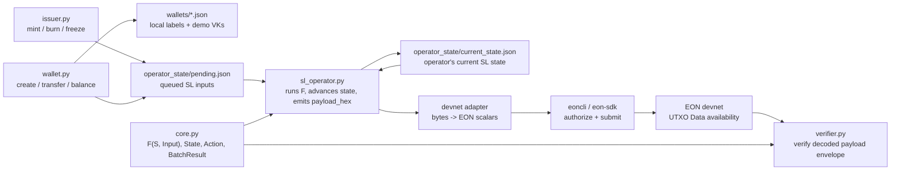

# EON Payment Token SL — Architecture

## Data Flow



The project no longer has a local base-layer substitute. The canonical target
for posted data is EON devnet.

## Who Writes Where

| Path | Writer(s) | Readers |
| --- | --- | --- |
| `wallets/` | `wallet.py create` | all CLIs for name -> address lookup |
| `operator_state/sl_config.json` | `sl_operator.py init` | issuer, operator, verifier tooling |
| `operator_state/current_state.json` | `sl_operator.py batch` | wallet balance, nonce calculation, operator |
| `operator_state/pending.json` | `issuer.py`, `wallet.py`, `sl_operator.py` clears | `sl_operator.py batch` |
| EON devnet UTXO `Data` | devnet adapter via `eoncli` / SDK | verifier / explorer / clients |

## Lifecycle Of One Action

```text
issuer.py mint --to alice --amount 10000
  -> load issuer_vk from operator_state/sl_config.json
  -> resolve alice through wallets/alice.json
  -> compute next nonce from current_state + pending queue length
  -> append action to operator_state/pending.json

sl_operator.py batch
  -> read pending actions
  -> Action.from_dict(...)
  -> process_batch(state, actions)
  -> apply_action(state, action) for each input
  -> produce BatchResult
  -> save current_state.json
  -> clear pending.json
  -> print canonical payload_hex

devnet adapter
  -> take BatchResult.data_field_payload()
  -> frame/chunk bytes into EON scalar Data
  -> construct a data-bearing self-owned output
  -> authorize and submit with eoncli / eon-sdk

verifier.py
  -> consume a decoded payload envelope fetched from devnet
  -> verify payload_hex matches decoded fields
  -> rerun F(S, Input)
  -> compare computed state hash to claimed new_state_hash
```

## Function Map

### `core.py`

```text
Identity
  hash_vk(vk)                       -> addr = SHA256(vk)[:40]

Types
  ActionType                        MINT | BURN | TRANSFER | FREEZE | UNFREEZE
  Action                            sender_vk, nonce, to?, from_addr?, amount?, target?
  State                             issuer_vk, balances, total_supply, nonce, frozen
  TransitionError                   raised by F on rejection

Transition
  apply_action(state, action)       F(S, Input) -> S'
  process_batch(state, actions)     sequentially apply valid actions
  verify_batch(prev_state, actions, claimed_hash)
  BatchResult.data_field_payload()  SL_ID | version | prev | new | count | actions

Persistence helpers
  load_sl_config()
  load_current_state() / save_current_state()
  load_pending() / save_pending() / append_pending()
  next_nonce()
  load_wallet() / save_wallet() / resolve_address()
```

### `sl_operator.py`

```text
cmd_init      create local state directories; write config and genesis state
cmd_pending   show queued inputs
cmd_status    show current SL state
cmd_batch     run F over pending inputs; print canonical devnet payload_hex
cmd_reset     delete generated local state and wallet labels
```

### `wallet.py`

```text
cmd_create    generate demo VK and local wallet label
cmd_address   print local wallet address
cmd_balance   read current SL state balance
cmd_transfer  queue TRANSFER input
```

### `issuer.py`

```text
cmd_mint      queue MINT input
cmd_burn      queue BURN input
cmd_freeze    queue FREEZE input
cmd_unfreeze  queue UNFREEZE input
```

### `verifier.py`

```text
cmd_check_envelope
  read decoded payload envelope JSON
  check prev_state_hash against prev_state
  check payload_hex against canonical encoding
  verify_batch(prev_state, actions, new_state_hash)
```

## Trust Model

```text
Trusts:                         Does NOT trust:
-----------------------------   ------------------------------------
core.py's F()                   operator's new_state_hash claim
SL config issuer_vk             queued pending actions
EON devnet ordering + DA        EON devnet to verify payment logic
decoded devnet payload bytes    issuer/wallet labels as protocol identity
```

The operator is ecosystem-trusted, not protocol-trusted. It can propose a false
state hash, but verifiers reject the payload because re-executing `F` will not
produce the claimed `new_state_hash`.
