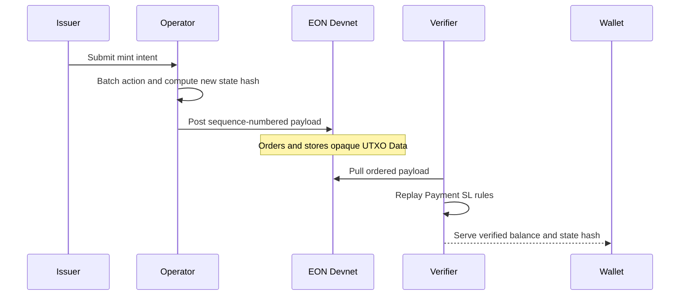
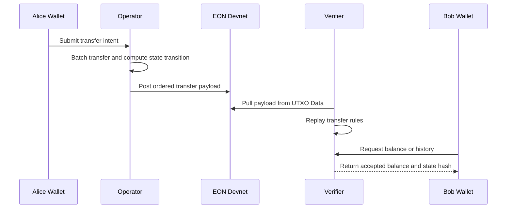
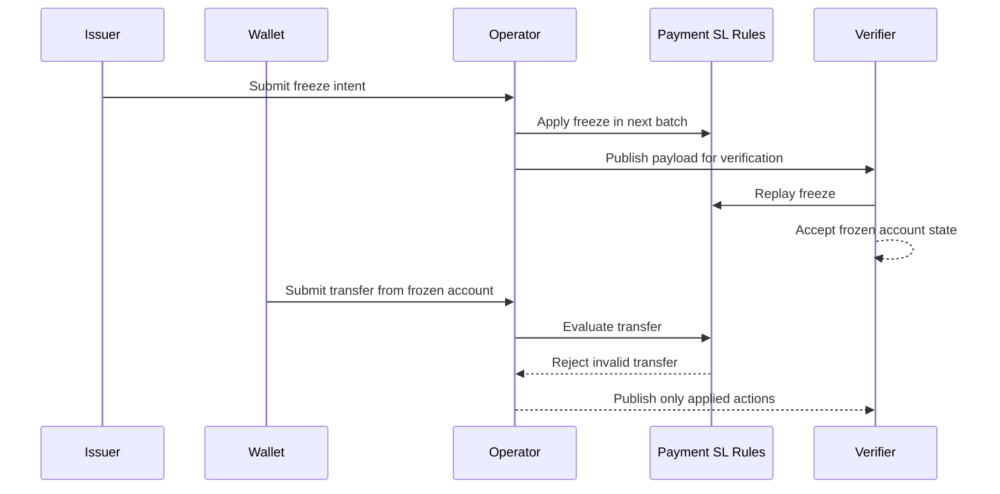
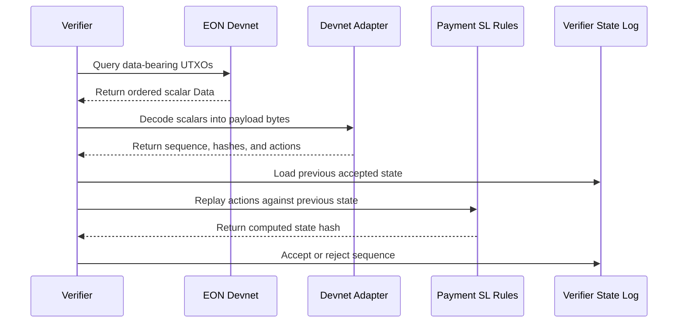
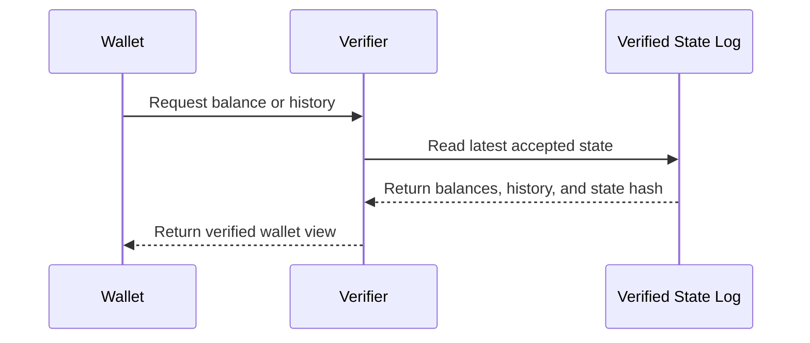
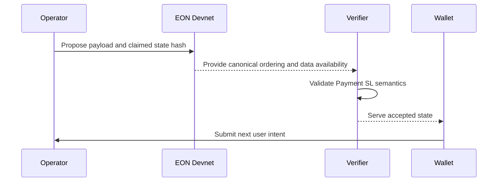
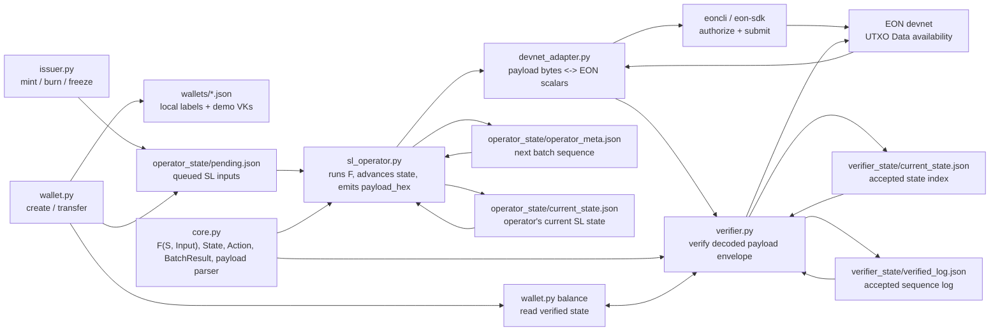

# EON Payment Token SL — Architecture

## Conversation Flows

These sequence diagrams are designed for demos and stakeholder conversations.
They describe what each party does before showing the lower-level repo map.

### 1. Issuance Flow



Implementation: `issuer.py mint` queues the action, `sl_operator.py batch`
emits `payload_hex`, and `verifier.py accept-envelope` persists accepted state.

### 2. Wallet Transfer Flow



Implementation: `wallet.py transfer` appends a pending action; wallets read
from verifier-indexed state by default through `wallet.py balance`.

### 3. Compliance / Rejection Flow



Implementation: freeze and transfer validity are enforced by `core.py`; rejected
actions are reported by the operator but are not included as applied payload
actions.

### 4. Verifier Sync Flow



Implementation: `devnet_adapter.py` converts scalar `Data` into payload bytes;
`verifier.py` checks sequence, payload encoding, and replayed state hash.

### 5. Wallet Read Flow



Implementation: the demo stores accepted state under `verifier_state/`; the
operator's local state is only for local debugging.

### 6. Trust Boundary Flow



Implementation: EON supplies ordering and retrievable opaque data; Payment SL
verifiers supply validity by re-executing `F(S, Input)`.

## Reference Map



The reference map is intentionally more implementation-heavy than the
conversation flows. The canonical target for posted data is EON devnet.

## Who Writes Where

| Path | Writer(s) | Readers |
| --- | --- | --- |
| `wallets/` | `wallet.py create` | all CLIs for name -> address lookup |
| `operator_state/sl_config.json` | `sl_operator.py init` | issuer, operator, verifier tooling |
| `operator_state/current_state.json` | `sl_operator.py batch` | wallet balance, nonce calculation, operator |
| `operator_state/operator_meta.json` | `sl_operator.py init`, `sl_operator.py batch` | operator |
| `operator_state/pending.json` | `issuer.py`, `wallet.py`, `sl_operator.py` clears | `sl_operator.py batch` |
| `verifier_state/current_state.json` | `verifier.py accept-envelope` | wallets, verifier status, clients |
| `verifier_state/verified_log.json` | `verifier.py accept-envelope` | wallets, explorers, clients |
| EON devnet UTXO `Data` | devnet adapter via `eoncli` / SDK | verifier / explorer / clients |

## Lifecycle Of One Action

```text
issuer.py mint --to alice --amount 10000
  -> load issuer_vk from operator_state/sl_config.json
  -> resolve alice through wallets/alice.json
  -> compute next nonce from current_state + pending queue length
  -> append action to operator_state/pending.json

sl_operator.py batch
  -> read pending actions
  -> read next batch sequence from operator_meta.json
  -> Action.from_dict(...)
  -> process_batch(state, actions, sequence)
  -> apply_action(state, action) for each input
  -> produce BatchResult
  -> save current_state.json
  -> clear pending.json
  -> increment operator_meta.json next_sequence
  -> print canonical sequence-numbered payload_hex

devnet adapter
  -> take BatchResult.data_field_payload()
  -> length-prefix and frame bytes into EON scalar Data
  -> construct a data-bearing self-owned output
  -> authorize and submit with eoncli / eon-sdk

verifier / indexer
  -> query EON UTXOs carrying Payment SL Data
  -> decode scalar Data back into payload bytes
  -> parse sequence, hashes, and actions from payload
  -> build an envelope using its current accepted previous state
  -> verify payload_hex matches decoded fields and expected sequence
  -> rerun F(S, Input)
  -> compare computed state hash to claimed new_state_hash
  -> persist accepted state and verified log

wallet.py balance
  -> ask/read the verifier-indexed state by default
  -> show balance at the latest verifier-accepted state
```

## Function Map

### `core.py`

```text
Identity
  hash_vk(vk)                       -> addr = SHA256(vk)[:40]

Types
  ActionType                        MINT | BURN | TRANSFER | FREEZE | UNFREEZE
  Action                            sender_vk, nonce, to?, from_addr?, amount?, target?
  State                             issuer_vk, balances, total_supply, nonce, frozen
  TransitionError                   raised by F on rejection

Transition
  apply_action(state, action)       F(S, Input) -> S'
  process_batch(state, actions, sequence)
  verify_batch(prev_state, actions, claimed_hash)
  BatchResult.data_field_payload()  SL_ID | version | sequence | prev | new | count | actions
  parse_data_field_payload(bytes)   decode devnet payload bytes into envelope fields

Persistence helpers
  load_sl_config()
  load_current_state() / save_current_state()
  load_operator_meta() / save_operator_meta()
  next_batch_sequence() / advance_batch_sequence()
  load_verified_state() / save_verified_state()
  load_verified_log() / save_verified_log()
  load_pending() / save_pending() / append_pending()
  next_nonce()
  load_wallet() / save_wallet() / resolve_address()
```

### `sl_operator.py`

```text
cmd_init      create local state directories; write config and genesis state
cmd_pending   show queued inputs
cmd_status    show current SL state
cmd_batch     run F over pending inputs; print canonical devnet payload_hex
cmd_reset     delete generated local state and wallet labels
```

### `devnet_adapter.py`

```text
payload_bytes_to_scalar_hex()
  length-prefix canonical payload bytes and split into current devnet scalar words
scalar_hex_to_payload_bytes()
  reassemble decoded EON Data scalar words into canonical payload bytes
envelope_from_scalars()
  parse payload bytes and combine them with verifier-held previous state
```

### `wallet.py`

```text
cmd_create    generate demo VK and local wallet label
cmd_address   print local wallet address
cmd_balance   read verifier-indexed balance by default
cmd_transfer  queue TRANSFER input
```

### `issuer.py`

```text
cmd_mint      queue MINT input
cmd_burn      queue BURN input
cmd_freeze    queue FREEZE input
cmd_unfreeze  queue UNFREEZE input
```

### `verifier.py`

```text
cmd_check_envelope
  read decoded payload envelope JSON
  check prev_state_hash against prev_state
  parse payload_hex and check canonical encoding
  verify_batch(prev_state, actions, new_state_hash)
cmd_accept_envelope
  verify decoded payload envelope
  require sequence == len(verified_log) + 1
  require prev_state_hash matches current verifier state after genesis
  write verifier_state/current_state.json
  append verifier_state/verified_log.json
cmd_status
  show latest verifier-indexed state
cmd_reset
  delete verifier-indexed state
```

## Trust Model

```text
Trusts:                         Does NOT trust:
-----------------------------   ------------------------------------
core.py's F()                   operator's new_state_hash claim
SL config issuer_vk             queued pending actions
EON devnet ordering + DA        EON devnet to verify payment logic
decoded devnet payload bytes    issuer/wallet labels as protocol identity
verifier-indexed state          operator API as wallet balance source
```

The operator is ecosystem-trusted, not protocol-trusted. It can propose a false
state hash, but verifiers reject the payload because re-executing `F` will not
produce the claimed `new_state_hash`.
