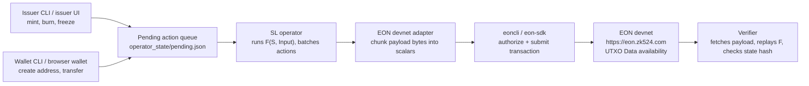

# EON Payment Token — Multi-Actor SL Demo

A Python CLI demo of a Payment Token semantic layer (SL) running on EON
Protocol. It models a centralized-issuer stablecoin (USDC model) with four
distinct actors and a devnet-oriented data-availability boundary.

    State Machine:  S_{i+1} = F(S_i, Input_i)
    Prf3 Strategy:  Path (a) — post raw inputs + state hashes, verifiers re-execute
    Base Layer:     EON devnet UTXO Data payload

The repo currently includes an offline CLI harness so the SL mechanics are easy
to inspect. The intended internal demo should use EON devnet as the data
availability layer: the operator posts each canonical batch payload into a
data-bearing EON UTXO through `eoncli` / the SDK.

## Actors

| Actor        | Script        | Role                                                                     |
| ------------ | ------------- | ------------------------------------------------------------------------ |
| Issuer       | `issuer.py`   | Authority VK. Queues mint / burn / freeze / unfreeze actions.            |
| Wallet       | `wallet.py`   | End user (Alice, Bob, Charlie). Queues transfers.                        |
| Operator     | `sl_operator.py` | Runs F(), batches pending actions, posts canonical payloads.             |
| Verifier     | `verifier.py` | Trust-minimized. Re-executes blocks and checks state-hash commitments.   |
| EON devnet   | `eoncli` / SDK | Orders transactions and stores retrievable UTXO `Data`.                 |
| Offline harness | `base_layer/` | Optional local stand-in used by the CLI walkthrough only.              |

## Layout

```
payment_sl/
├── core.py           # state machine (F), actions, payload serialization
├── issuer.py         # issuer CLI
├── wallet.py         # wallet CLI
├── sl_operator.py    # operator CLI
├── verifier.py       # verifier CLI
├── base_layer/       # optional offline DA harness — block_NNN.json files
├── wallets/          # per-actor identity files
├── operator_state/   # operator's persistent state + pending queue
└── README.md
```

## Design invariants

1. **Pure Python, standard library only.** No external dependencies.
2. **The payment SL owns validity.** EON only orders and stores the posted `Data`.
3. **The operator is the only party that posts canonical batches.** Issuer and wallets only queue actions.
4. **Nonces are automatic.** Each CLI computes the next nonce from the current state plus existing pending queue length. Users never specify nonces.
5. **Wallet names are just local labels.** On-chain the only identifier is the address `Hash(VK)`.

## EON devnet mapping

For the internal hosted demo, use the live devnet path as the primary
architecture:



The operator submits the canonical batch payload as an EON output's `Data`
field:

```text
[SL_ID][version][prev_state_hash][new_state_hash][batch_count][actions...]
```

The important split stays the same:

| Layer | Responsibility |
| --- | --- |
| Payment SL | Defines `F(S, Input)`, token balances, issuer authority, freezes, burns, transfers, and state hashes. |
| Operator | Orders pending SL actions into batches and posts the canonical payload. |
| EON devnet | Orders the transaction, stores the UTXO `Data`, and makes it retrievable. It does not execute payment-token logic. |
| Verifier | Fetches the payload, decodes it, replays `F`, and checks the claimed state hash. |

Useful `eoncli` commands around the devnet integration:

```bash
export EON_API_HTTP_URL=https://eon.zk524.com

eoncli create-normal-account operator.pk
eoncli get-address operator.pk
eoncli get-balance <operator-address>
eoncli list-utxo <operator-address>
eoncli get-vk operator.pk
```

The ergonomic posting path still needs a small adapter. EON `Data` is currently
scalar-oriented, so the adapter should:

1. Take `BatchResult.data_field_payload()`.
2. Frame/chunk the bytes into EON scalars.
3. Build a self-owned data-bearing output whose amount covers `price * data_len`.
4. Authorize and submit the transaction with `eoncli` / `eon-sdk`.
5. Let verifiers fetch the resulting UTXO, decode `Data`, and replay the SL.

The existing `base_layer/block_NNN.json` writer is only an offline substitute
for the devnet posting step. It is useful for explaining and testing the SL
without network dependencies, but it should not be part of the hosted internal
demo architecture.

## Offline CLI walkthrough

Run everything from inside the `payment_sl/` directory.

### Setup

```bash
python sl_operator.py init --issuer-vk "circle_inc_verification_key"
python wallet.py create --name alice
python wallet.py create --name bob
python wallet.py create --name charlie
```

```
SL initialized.
  Issuer VK:   circle_inc_verification_key
  SL ID:       0x00010001
  Version:     0x0001
  Genesis state hash: 7c957be6a7b9da22293cc299d1358b64866606610c57cf17dca64156bf1826b2
Wallet created: alice
  Address: ff1b3f6c...
Wallet created: bob
  Address: 9ba96481...
Wallet created: charlie
  Address: 0146042a...
```

Addresses are deterministic from the VK but the VK itself uses a random
suffix (`alice_vk_<8 hex>`), so your addresses will differ from those
shown below.

### Act 1 — Issuance

```bash
python issuer.py mint --to alice --amount 10000
python issuer.py mint --to bob --amount 5000
python sl_operator.py pending
python sl_operator.py batch
python sl_operator.py status
```

```
Mint queued: 10,000 tokens -> alice (nonce 1)
Mint queued: 5,000 tokens -> bob (nonce 2)
Pending actions (2):
  [0] nonce=1   MINT          10000 -> ff1b3f6c  (by circle_i)
  [1] nonce=2   MINT           5000 -> 9ba96481  (by circle_i)
Batch posted: block_001.json
  Submitted: 2
  Applied:   2
  Rejected:  0
    [0] applied   nonce=1   MINT          10000 -> ff1b3f6c  (by circle_i)
    [1] applied   nonce=2   MINT           5000 -> 9ba96481  (by circle_i)
  Prev state hash: 7c957be6a7b9da22293cc299d1358b64866606610c57cf17dca64156bf1826b2
  New state hash:  d23707b5f3c470e677b1fc72055ba925d2fa9114b3163ab98d93ee314406f5e3
  Payload size:    335 bytes
  Written to:      base_layer/block_001.json
SL Status
  State hash:   d23707b5f3c470e677b1fc72055ba925d2fa9114b3163ab98d93ee314406f5e3
  Total supply: 15,000
  Nonce:        2
  Balances (2):
    9ba96481...       5,000  (bob)
    ff1b3f6c...      10,000  (alice)
  Frozen:       (none)
```

### Act 2 — Payments

```bash
python wallet.py transfer --name alice --to bob --amount 3000
python issuer.py mint --to charlie --amount 2000
python sl_operator.py batch
python wallet.py balance --name alice
python wallet.py balance --name bob
```

```
Transfer queued: alice -> bob, 3,000 tokens (nonce 3)
Mint queued: 2,000 tokens -> charlie (nonce 4)
Batch posted: block_002.json
  Submitted: 2
  Applied:   2
  Rejected:  0
  ...
  New state hash:  3710fbd703aa136fd942ddb4061c005c272ddd7275ca5d7ca24a474c6036d345
alice: 7,000 tokens
bob: 8,000 tokens
```

Notice the transfer and the mint live in the *same* block. Actions
from different actors are naturally multiplexed by the operator.

### Act 3 — Compliance

Charlie is flagged. The issuer freezes his address; Charlie tries to move
funds anyway in the same batch. The transfer is rejected at F() but the
block is still posted — the rejection is part of the public record.

```bash
python issuer.py freeze --target charlie
python wallet.py transfer --name charlie --to alice --amount 1000
python sl_operator.py batch
python sl_operator.py status
```

```
Freeze queued: charlie (nonce 5)
Transfer queued: charlie -> alice, 1,000 tokens (nonce 6)
Batch posted: block_003.json
  Submitted: 2
  Applied:   1
  Rejected:  1
    [0] applied   nonce=5   FREEZE     0146042a  (by circle_i)
    [1] REJECTED  nonce=6   TRANSFER       1000 0146042a -> ff1b3f6c  (by charlie_)
          reason: Address 0146042a11522185df092afddcde1770e2431cd5 is frozen
  ...
SL Status
  State hash:   087e1f7f374253ea45f471a9bfc0ea2b519f0b788a58f46811eb8a26be38cffb
  Total supply: 17,000
  Nonce:        5
  Balances (3):
    0146042a...       2,000  (charlie)
    9ba96481...       8,000  (bob)
    ff1b3f6c...       7,000  (alice)
  Frozen (1):
    0146042a...  (charlie)
```

State nonce only advanced to 5 (the freeze), not 6 — rejected actions
don't consume nonces. The next submission picks up at nonce 6.

### Act 4 — Redemption

```bash
python issuer.py burn --from bob --amount 2000
python sl_operator.py batch
python sl_operator.py status
```

```
Burn queued: 2,000 tokens <- bob (nonce 6)
Batch posted: block_004.json
  Submitted: 1
  Applied:   1
  Rejected:  0
  ...
  New state hash:  d1049559f0e82a2efe6043cd6529ffa68a40968e564a8bf26510d959de76af54
SL Status
  State hash:   d1049559f0e82a2efe6043cd6529ffa68a40968e564a8bf26510d959de76af54
  Total supply: 15,000
  Nonce:        6
  ...
```

### Verification

The verifier trusts nothing except the transition function in `core.py`
and the posted batch payloads. In the offline walkthrough, those payloads live
in `base_layer/block_NNN.json`. It re-executes each batch and
recomputes the state-hash commitment.

```bash
python verifier.py check --block base_layer/block_001.json
python verifier.py check-all
```

```
block_001: VERIFIED
  prev_state_hash: 7c957be6a7b9da22293cc299d1358b64866606610c57cf17dca64156bf1826b2
  new_state_hash:  d23707b5f3c470e677b1fc72055ba925d2fa9114b3163ab98d93ee314406f5e3
  actions applied: 2
  actions rejected at batch time: 0
Verifying 4 block(s) from genesis...
  Genesis state hash: 7c957be6a7b9da22293cc299d1358b64866606610c57cf17dca64156bf1826b2
  block_001: VERIFIED  (2 action(s), new hash d23707b5f3c470e6...)
  block_002: VERIFIED  (2 action(s), new hash 3710fbd703aa136f...)
  block_003: VERIFIED  (1 action(s), new hash 087e1f7f374253ea...)
  block_004: VERIFIED  (1 action(s), new hash d1049559f0e82a2e...)
All 4/4 blocks verified.
```

### Tamper detection

Edit any `base_layer/block_NNN.json` — change an amount, delete an
action, swap a hash — and re-run the verifier. The mismatch surfaces as
a failed state-hash check or a re-execution error, and the verifier
exits with status 1.

```bash
# Example: change an amount in block_002.json, then:
python verifier.py check --block base_layer/block_002.json
# -> block_002: FAILED - Re-execution failed: Insufficient balance: 10000 < 99999
```

## Starting over

```bash
python sl_operator.py reset
```

Deletes `operator_state/`, `base_layer/`, and `wallets/`.

## What this demo is showing

The **EON devnet** stores opaque data. It never executes the SL's logic — it
only guarantees that posted `Data` is ordered and retrievable. In the current
Rust implementation, EON `Data` is scalar-oriented (`Vec<Scalar>`), so the
devnet adapter should chunk or otherwise encode this demo's byte payload into
scalars.

The offline CLI walkthrough still writes `base_layer/block_NNN.json` as a local
stand-in for a UTXO whose `Data` field carries the operator's batch payload:

    [SL_ID: 4B][version: 2B][prev_hash: 32B][new_hash: 32B][batch_count: 2B][actions...]

In offline mode, that payload is stored in `payload_hex` inside each block file.
The verifier checks that `payload_hex` matches the canonical encoding of the
decoded block fields before it re-executes the state transition.

The **operator** is trusted-by-ecosystem, not trusted-by-protocol. It
could in principle lie about the new state hash, but anyone running the
verifier will catch it on the next block — the chain of state-hash
commitments won't line up. This is what "SL" means in EON: a state
machine whose correctness is enforced by re-executable inputs plus
state-hash commitments, not by base-layer consensus.

The **issuer** is the one centralized role. Only the VK that was
registered at `sl_operator.py init` can mint, burn, or freeze. Everyone
else is a self-sovereign wallet — their right to move their own tokens
is enforced by F() matching `sender_vk -> Hash(VK) -> from_addr`.
