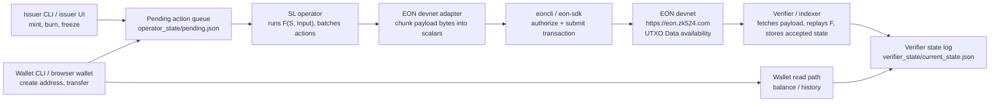

# EON Payment Token — Multi-Actor SL Demo

A Python CLI demo of a Payment Token semantic layer (SL) running on EON
Protocol. It models a centralized-issuer stablecoin (USDC model) with four
distinct actors and a devnet-oriented data-availability boundary.

    State Machine:  S_{i+1} = F(S_i, Input_i)
    Prf3 Strategy:  Path (a) — post raw inputs + state hashes, verifiers re-execute
    Base Layer:     EON devnet UTXO Data payload

The intended internal demo uses EON devnet as the data availability layer. The
operator prepares a canonical batch payload, then a devnet adapter should encode
that payload into EON scalars and submit it with `eoncli` / the SDK.

## Actors

| Actor | Script | Role |
| --- | --- | --- |
| Issuer | `issuer.py` | Authority VK. Queues mint / burn / freeze / unfreeze actions. |
| Wallet | `wallet.py` | End user. Creates local labels, queues transfers, reads balances from verifier-indexed state. |
| Operator | `sl_operator.py` | Runs F(), batches pending actions, prepares canonical devnet payloads. |
| Verifier | `verifier.py` | Re-executes decoded payload envelopes, accepts valid state, serves wallet reads. |
| EON devnet | `eoncli` / SDK | Orders transactions and stores retrievable UTXO `Data`. |

## Layout

```text
payment_sl/
├── core.py           # state machine (F), actions, payload serialization
├── issuer.py         # issuer CLI
├── wallet.py         # wallet CLI
├── sl_operator.py    # operator CLI
├── verifier.py       # verifier CLI for decoded devnet payload envelopes
├── wallets/          # generated local wallet labels
├── operator_state/   # generated local state + pending queue
├── verifier_state/   # generated verifier-indexed accepted state
└── README.md
```

## Design Invariants

1. **The payment SL owns validity.** EON orders and stores posted `Data`; it does not execute payment-token rules.
2. **The operator posts canonical batches.** Issuer and wallets only queue actions.
3. **Nonces are automatic.** Each CLI computes the next nonce from current state plus pending queue length.
4. **Wallets read verified state.** Wallet balances come from verifier-indexed state, not the operator's local state.
5. **Wallet names are local labels.** The identity used by the SL is the address `Hash(VK)`.
6. **EON `Data` is scalar-oriented.** The devnet adapter must frame/chunk this demo's payload bytes into EON scalars.

## Architecture



The operator prepares this canonical payload:

```text
[SL_ID][version][prev_state_hash][new_state_hash][batch_count][actions...]
```

The devnet adapter should:

1. Take `BatchResult.data_field_payload()`.
2. Frame/chunk the bytes into EON scalars.
3. Build a self-owned data-bearing output whose amount covers `price * data_len`.
4. Authorize and submit the transaction with `eoncli` / `eon-sdk`.
5. Let verifiers fetch the resulting UTXO, decode `Data`, replay the SL, and update their accepted state log.
6. Let wallets read balances from verifier-indexed state.

Useful `eoncli` commands around the devnet integration:

```bash
export EON_API_HTTP_URL=https://eon.zk524.com

eoncli create-normal-account operator.pk
eoncli get-address operator.pk
eoncli get-balance <operator-address>
eoncli list-utxo <operator-address>
eoncli get-vk operator.pk
```

## CLI Walkthrough

Run everything from inside the `payment_sl/` directory.

### Setup

```bash
python sl_operator.py init --issuer-vk "circle_inc_verification_key"
python wallet.py create --name alice
python wallet.py create --name bob
python wallet.py create --name charlie
```

Addresses are deterministic from each generated VK. Wallet names are only local
labels used by the demo CLIs.

### Issuance

```bash
python issuer.py mint --to alice --amount 10000
python issuer.py mint --to bob --amount 5000
python sl_operator.py pending
python sl_operator.py batch
python sl_operator.py status
```

`sl_operator.py batch` applies valid actions, advances local SL state, clears
the pending queue, and prints the canonical payload hex that should be posted to
EON devnet by the adapter.

### Payments

```bash
python wallet.py transfer --name alice --to bob --amount 3000
python issuer.py mint --to charlie --amount 2000
python sl_operator.py batch
python wallet.py balance --name alice --source operator
python wallet.py balance --name bob --source operator
```

Actions from different actors are naturally multiplexed by the operator into
one batch.

### Compliance

```bash
python issuer.py freeze --target charlie
python wallet.py transfer --name charlie --to alice --amount 1000
python sl_operator.py batch
python sl_operator.py status
```

The freeze applies. The transfer is rejected by F() because Charlie is frozen.
Rejected actions do not advance the SL nonce.

### Redemption

```bash
python issuer.py burn --from bob --amount 2000
python sl_operator.py batch
python sl_operator.py status
```

Only the issuer VK registered at `sl_operator.py init` can mint, burn, freeze,
or unfreeze.

## Verification

`verifier.py` verifies decoded devnet payload envelopes and can persist accepted
state into `verifier_state/`. A devnet adapter should fetch the EON UTXO, decode
its scalar `Data` back into the canonical payload, and provide the previous
state plus decoded actions:

```json
{
  "prev_state": { "...": "State.to_dict() output" },
  "prev_state_hash": "hex",
  "new_state_hash": "hex",
  "actions_applied": [],
  "payload_hex": "hex"
}
```

Then run:

```bash
python verifier.py check-envelope --file payload-envelope.json
python verifier.py accept-envelope --file payload-envelope.json
python verifier.py status
```

The verifier checks that `payload_hex` matches the decoded envelope fields,
replays `F(S, Input)`, and compares the computed state hash to
`new_state_hash`. `accept-envelope` writes the latest accepted state to
`verifier_state/current_state.json` and appends to
`verifier_state/verified_log.json`.

Wallets read balances from verifier-indexed state by default:

```bash
python wallet.py balance --name alice
```

For local operator debugging only, a wallet can still read the operator's
unverified state:

```bash
python wallet.py balance --name alice --source operator
```

## Starting Over

```bash
python sl_operator.py reset
python verifier.py reset
```

Deletes generated operator/wallet state and verifier-indexed state.

## What This Demo Shows

EON gives the Payment SL canonical ordering and retrievable opaque data. The
base layer does not know token balances, issuer authority, freezes, burns, or
transfer validity. Those rules live in `core.py` and are enforced by operators
and verifiers.

The architectural point is:

> Canonicity is shared. Validity is sovereign.
